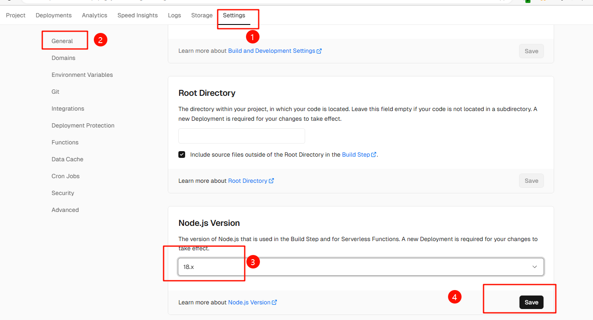
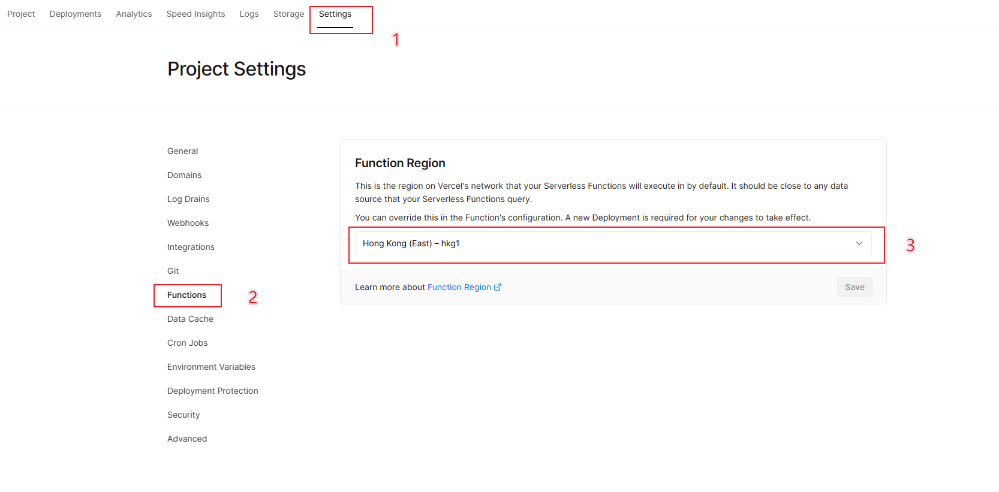
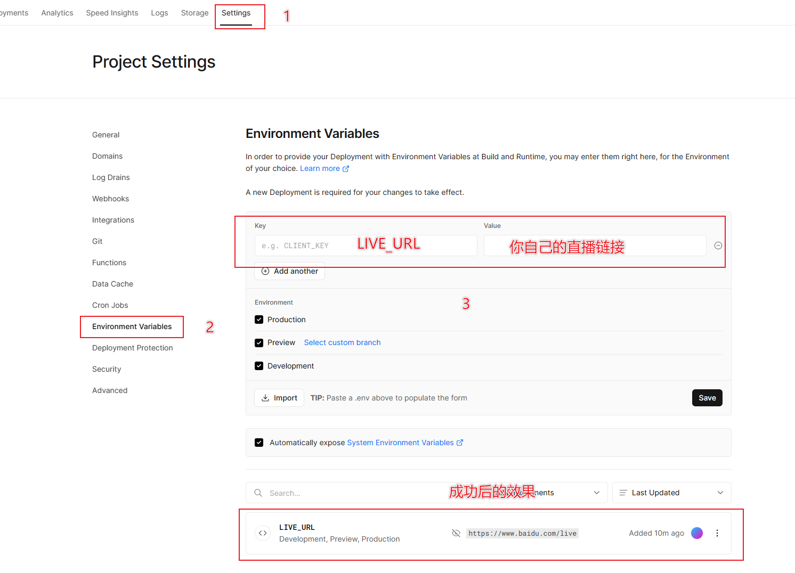
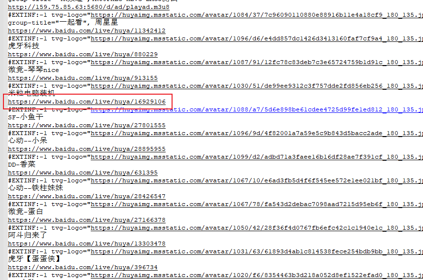

# iptv-go
这是一个通过Vercel部署Golang脚本实现 YouTube、虎牙、斗鱼、YY、抖音、BiliBili等直播通过m3u文件或播放器直接播放的项目

使用 [Vercel](https://vercel.com/) 部署 [https://github.com/ansoncloud8/iptv-go](https://github.com/ansoncloud8/iptv-go) 的 [Golang脚本](https://github.com/ansoncloud8/iptv-go/tree/main/liveurls)


## 一、部署

### 方式一（推荐）

点击下方按钮一键部署，还没注册的可以选择github登陆然后绑定手机即可

[](https://vercel.com/import/project?template=https://github.com/ansoncloud8/iptv-go)

新版vercel新建项目默认是node20.x的环境会提示部署失败，虽然加了`package.json`指定为18.x但是貌似没用，如果遇到部署失败的先去设置修改node为18.x


### ~~方式二~~

<details>
<summary>没必要fork了，一键部署更方便</summary>
1. Fork项目到自己的仓库
2. 在Vercel创建Project并选择`iptv-go`
3. Build&Deploy
4. Enjoy~
</details>

## 二、高级设置
 1. Vercel的Function Region设置为香港服务器看直播可以延迟会低一点
 
 > 设置完需要重新部署生效

<details>
<summary>其他可选设置</summary>

 1. Vercel分配的子域名访问有困难的话可以自定义域名`CNAME`到[cname-china.vercel-dns.com](cname-china.vercel-dns.com)
 > 非必要步骤且需要有自己的域名

 2. 设置Vercel的环境变量`LIVE_URL`可以替换返回的m3u直播链接，就不用通过请求连接的`url`参数设置了
 > 非必要步骤
 >
 > 例如设置环境变量为: `https://www.baidu.com/live`
 > 
 > 返回文件的效果
 > 
 > 
 > 优先级：链接的`url`参数 > 环境变量`LIVE_URL` > 默认域名
</details>


## 三、部署后详细使用方法
## **1、虎牙、斗鱼、YY实时M3U获取：**
### 虎牙一起看：
```
http://你的Vercel部署完成后分配的域名或Vercel绑定自定域名/huyayqk.m3u
如Vercel自动分配的域名:
http://iptv-go-seven-beige.vercel.app/huyayqk.m3u
```
### 斗鱼一起看：
```
http://你的Vercel部署完成后分配的域名或Vercel绑定自定域名/douyuyqk.m3u
如Vercel自动分配的域名:
http://iptv-go-seven-beige.vercel.app/douyuyqk.m3u
```
### YY轮播：
```
http://你的Vercel部署完成后分配的域名或Vercel绑定自定域名/yylunbo.m3u
如Vercel自动分配的域名:
http://iptv-go-seven-beige.vercel.app/yylunbo.m3u
```
### 如果使需要自定义M3U文件中的前缀域名，可以传入url参数（需要注意的是，当域名中含有特殊字符时，需要对链接进行urlencode处理）：
```
http://你的Vercel部署完成后分配的域名或Vercel绑定自定域名/xxxyqk.m3u?url=http://192.168.10.1:35455
如Vercel自动分配的域名:
http://iptv-go-seven-beige.vercel.app/xxxyqk.m3u?url=http://192.168.10.1:35455
```

## **1、虎牙、斗鱼、YY、抖音、BiliBili、YouTube播放地址**

## **虎牙`(huya.com/)xxxxxx`：**  
### 1，查看可用CDN：
```
http://你的Vercel部署完成后分配的域名或Vercel绑定自定域名/huya/xxxxx?type=display
```
### 2，切换媒体类型（默认flv，可选flv、hls）： 
```
http://你的Vercel部署完成后分配的域名或Vercel绑定自定域名/huya/xxxxx?media=hls
```
### 3，切换CDN（默认hwcdn，可选hycdn、alicdn、txcdn、hwcdn、hscdn、wscdn，具体可先访问1获取）：
```
http://你的Vercel部署完成后分配的域名或Vercel绑定自定域名/huya/xxxxx?cdn=alicdn
```
### 4，最后的代理链接示例：
```
http://你的Vercel部署完成后分配的域名或Vercel绑定自定域名/huya/xxxxx(?media=xxx&cdn=xxx)
```

## **斗鱼：**
### 1，可选m3u8和flv以及xs三种流媒体传输方式【`(www.douyu.com/)xxxxxx 或 (www.douyu.com/xx/xx?rid=)xxxxxx`，默认flv】：
```
http://你的Vercel部署完成后分配的域名或Vercel绑定自定域名/douyu/xxxxx(?stream=flv)
```

## **YY（默认最高画质，参数为4）:**
```
https://www.yy.com/xxxx
http://你的Vercel部署完成后分配的域名或Vercel绑定自定域名/yy/xxxx(?quality=1/2/3/4...)
```

## **抖音：**
### 默认最高画质，浏览器打开并复制`(live.douyin.com/)xxxxxx`，只需要复制后面的xxxxx即可（可选flv和hls两种种流媒体传输方式，默认flv）：
```
http://你的Vercel部署完成后分配的域名或Vercel绑定自定域名/douyin/xxxxx(?stream=hls)
```

## **BiliBili`(live.bilibili.com/)xxxxxx`：**
### 1，平台platform参数选择（默认web，如果有问题，可以切换h5平台）：
```
"web"   => "桌面端"
"h5"    => "h5端"
```
### 2，线路line参数选择（默认线路二，如果卡顿/看不了，请切换线路一或者三，一般直播间只会提供两条线路，所以建议线路一/二之间切换）：
```
"first"  => "线路一"
"second" => "线路二"
"third"  => "线路三"
```
### 3，画质quality参数选择（默认原画，可以看什么画质去直播间看看，能选什么画质就能加什么参数，参数错误一定不能播放）：
```
"30000" => "杜比"
"20000" => "4K"
"10000" => "原画"
"400"   => "蓝光"
"250"   => "超清"
"150"   => "高清"
"80"    => "流畅"
```
### 4，最后的代理链接示例：
```
http://你的Vercel部署完成后分配的域名或Vercel绑定自定域名/bilibili/xxxxxx(?platform=h5&line=first&quality=10000)
```

## **YouTube:**
```
https://www.youtube.com/watch?v=cK4LemjoFd0
Rid: cK4LemjoFd0
http://你的Vercel部署完成后分配的域名或Vercel绑定自定域名/youtube/cK4LemjoFd0(?quality=1080/720...)
```

## 更多平台后续会酌情添加
